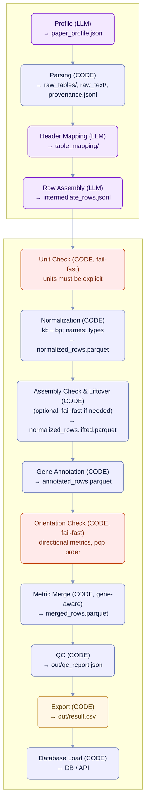

# Positive Selection Signals Database (PSSDB)

**PSSDB** is a cross-species, assembly-aware database of **recent positive-selection signals** aggregated from peer-reviewed studies.  
**Goal:** provide a single, normalized source of windows/SNPs under selection with traceable provenance for downstream exploration and comparative analyses.

http://192.168.100.54:8000/species

**Team**  
- Aiziya Paizulla
- Avel Urin
- Aleksandr Martynov
- Elizaveta Kolomytseva
- Mariia Mikhaleva  

**Mentors:** Polina Malysheva, Yury Barbitoff

## What is in the database (short)

Each record represents a **signal of recent positive selection** (SNP or genomic window). Fields are standardized across studies:

- **Identifiers & source:** DOI/PMID, article title/URL, `supplement_id`, provenance.
- **Species & assembly:** canonical species name, genome build (e.g., ARS-UCD1.2).
- **Coordinates:** `chrom`, `start`, `end` (windows) or `snp_pos` (SNPs), `is_snp` (1/0); 1-based inclusive.
- **Genes (when applicable):** `gene_symbol`, `gene_id`, `gene_overlap_type` (exon/utr/intron/promoter/downstream/intergenic).
- **Metrics:** `Fst`, `XP_EHH`, `iHS`, `nSL`, `XP_CLR`, `H12`, `H2_H1`, `omega`, `Pi`, `TajimaD` and their `_p` variants when available; presence flags (`*_presence="used"`) when only the method is reported.
- **Populations:** `population1`, `population2` (if applicable), and notes on the comparison.
- **Quality & notes:** `qc_flag`, normalization notes, and processing metadata.

> The ingestion pipeline (below) converts PDFs and supplements into this schema and loads validated records into the database.


--- 


# PSSDB — From Papers to a Standardized Dataset (Ingestion Pipeline)


The diagram and summary below describe how the ingestion component converts **PDF articles and supplements** into a **strict, merge‑ready CSV** and then **loads it into the database**.

## Block Diagram (with fail-fast gates and gene-aware merge)

## Pipeline at a Glance 

**Fail-fast gates.** The pipeline stops on unknown coordinate units, missing/ambiguous assembly when gene annotation is enabled, and uncertain population orientation for directional metrics (e.g., XP-EHH). These are treated as blocking errors, not warnings.

1) **Profile (context).** The article is analyzed once to capture the dataset contract: species and genome assembly, selection metrics and thresholds, comparison populations, and citation metadata. The result is saved as paper_profile.json and used to guide all subsequent steps.

2) **Parsing (mechanical intake).** All tables and text are extracted as-is from PDFs/DOCX/XLSX/TSV. A provenance trail records the origin of each row (file, sheet, page). No interpretation is performed at this stage.

3) **Header Mapping (bridge to the schema).** Source column names are mapped to the fixed PSSDB schema (for example, Chr → chrom, BP → snp_pos). Missing targets are listed explicitly to keep the process auditable and repeatable.

4) **Row Assembly (schema-shaped rows).** Parsed tables are converted into rows with the exact fields of the target schema. Coordinates are placed into (chrom, start, end, snp_pos, is_snp); populations follow the profile; supplement_id points to the original source. If a metric is used but has no numeric values, the corresponding presence flag is set to “used”.

5) **Normalization (comparability + unit guard).** Standardize units/names/types; **fail-fast** if units cannot be established for coordinates required downstream.

6) **Assembly Check & Liftover (optional).** If the article coordinates differ from the target assembly, perform chain-based liftover; **fail-fast** if chains are missing or loss exceeds a configured threshold.

7) **Gene Annotation (context).** Intersect with GTF/GFF on the verified assembly; emit one row per **(signal × gene)**.

8) **Orientation Check (directional tests).** Verify canonical population order from the profile; for directional metrics, do not flip sign without explicit evidence; otherwise **fail-fast** with `orientation_uncertain`.

9) **Metric Merge (one signal, many metrics, gene-aware).** Merge by keys that include `gene_id` (when present) to preserve the (signal × gene) mapping.

10) **QC (trustworthy output).** Consistency checks validate coordinate logic, population fields, presence flags versus numeric values, and mandatory metadata. Only a successful QC produces final artifacts.

11) **Export (merge‑ready CSV).** Data are written in the exact column order required by PSSDB and validated against the table schema. The deliverable is out/result.csv, reproducible and traceable to its sources.

12) **Database Load (ingestion into PSSDB).** The validated CSV is inserted or appended to the central database (or posted to an API endpoint), completing the ingestion cycle and making the data available for browsing and downstream analyses.


# Detailed Step Descriptions

## Step 1 — Profile (LLM)

**Purpose**  
Establish a machine-readable “contract” for the paper so downstream stages know the species, assembly, metrics, populations, and citation context.

**Inputs**
- `input/paper.pdf` (or equivalent)
- Optional: `input/overrides.yaml` (pre-known species/assembly)

**Outputs**
- `out/paper_profile.json` (strict JSON)
- `logs/profile.provenance.json` (tool versions, hashes, pages seen)

**Responsibilities (checklist)**
- [ ] Extract plain text from the PDF (layout-aware; OCR if scanned).  
- [ ] Identify **species** and **common name**.  
- [ ] Identify **genome assembly** exactly as used for selection scans.  
- [ ] List **selection metrics** (e.g., Fst, XP-EHH, iHS, nSL, XP-CLR, H12, H2/H1, ω, π, Tajima’s D).  
- [ ] Capture **thresholds/windowing** if stated (e.g., 100 kb windows, |iHS| > 2.58).  
- [ ] Capture **populations** and their **aliases** (e.g., NeC, NeS, NeT).  
- [ ] Record **citation metadata** (DOI, PMID, title, URL).  
- [ ] Store **notes** for any ambiguity (do not guess).  

**LLM contract**
- Output must be **strict JSON** matching the profile schema (no free text).  
- Unknown/unstated fields must remain **empty**; no inference.  
- Ambiguity may be summarized in a `notes` field; facts must not be invented.

**Shape (illustrative)**

~~~json
{
  "species": "Bos taurus",
  "common_name": "cattle (Nelore breed)",
  "assembly": "UMD3.1.1",
  "doi": "10.1186/s12711-018-0381-2",
  "pmid": "",
  "article_title": "...",
  "article_url": "https://doi.org/...",
  "metrics": [
    {
      "name": "Fst",
      "threshold": "top 1% per 100-kb window",
      "windowing": "100 kb, 75 kb overlap",
      "note": ""
    },
    {
      "name": "XP_EHH",
      "threshold": "mean > 2.58",
      "windowing": "100 kb",
      "note": ""
    }
  ],
  "populations": [
    {
      "name": "Nelore Control",
      "aliases": ["NeC"],
      "note": ""
    },
    {
      "name": "Nelore Selection",
      "aliases": ["NeS"],
      "note": ""
    }
  ],
  "notes": "..."
}
~~~


**Validation**
- Validate against `jsonschema` (required keys, types).  
- Cross-checks:
  - Assemblies mentioned in text vs. the one used for scans.  
  - Population aliases also appear in tables/figures.  
  - Threshold strings are parsable when present.  
- On failure: generate a compact error report and re-prompt the same LLM to **fix only the listed issues**.

**Provenance & caching**
- Save PDF hash, OCR flag, extractor version, and page ranges in `logs/profile.provenance.json`.  
- If hashes and tool versions match, the step is skipped (cache hit).

**Failure modes to watch**
- Multiple assemblies mentioned → keep the one **explicitly** used for scans; note alternatives in `notes`.  
- Metrics cited in methods but not used in results → note this; downstream may set `*_presence="used"` where appropriate.

---

## Step 2 — Parsing (CODE)

**Purpose**  
Create an **exact, lossless snapshot** of all source tables and text, with complete lineage and without any interpretation or unit conversion.

**Inputs**
- All files in `input/` (PDF, DOCX, XLSX/CSV/TSV, supplementary PDFs)

**Outputs**
- `raw_tables/<table_id>.parquet` (one per file/sheet/table)
- `raw_text/article.txt` (PDF text dump; OCR-backed if needed)
- `provenance.jsonl` (one line per extracted table with full lineage)

**Extraction rules**
- **PDF**
  - Text: pdfplumber / PyMuPDF; if scanned → OCR (pytesseract) first.  
  - Tables: camelot / tabula; choose lattice/stream per page; one table → one artifact.  
- **DOCX**: python-docx tables; capture captions such as “Table S3” if present.  
- **XLSX/CSV/TSV**: openpyxl / pandas; one artifact per sheet/file.

**What is preserved**
- Original **headers** unchanged (no renaming).  
- Original **cell strings** (no kb→bp, no Chr parsing, no numeric coercion).  
- Thousands/decimal separators as in source; encodings normalized to UTF-8.  
- Multi-row headers flattened conservatively (e.g., join with a space) while the **raw header text** is kept in metadata.

**What is recorded for each table**
- `source_file`, `sheet_or_table`, detected `supplement_id` (e.g., “Table S4”).  
- PDF page range, extraction mode (lattice/stream/docx/xlsx), and tool versions.  
- `content_sha1` over the normalized tabular content (deduplication).  
- Optional `extraction_note` (e.g., “low-contrast grid; OCR applied”).

**Produced files (example)**
    raw_tables/
      S3_lattice_p12-13.parquet
      S4_stream_p18.parquet
      supp_table1_sheetA.parquet
    raw_text/
      article.txt
    provenance.jsonl

**Deduplication & skips**
- If two artifacts share the same `content_sha1`, keep one and add the other origins to its provenance.  
- Empty or header-only tables are skipped with a logged reason.

**Provenance line (illustrative)**
    {
      "table_id": "S4_stream_p18",
      "source_file": "MOESM1.docx",
      "sheet_or_table": "Table S4",
      "supplement_id": "Table S4",
      "pages": "18",
      "parser": "tabula:stream",
      "ocr": false,
      "content_sha1": "sha1:...",
      "extraction_note": "ok"
    }

**Idempotency & cache**
- If inputs, tool versions, and configs are unchanged, the step is a no-op.  
- Any change invalidates only the affected artifacts.

**Failure modes to watch**
- Non-UTF-8 encodings → normalize to UTF-8, log the original.  
- Merged cells / multi-line text → store visible text; keep raw in metadata if truncated.  
- Inconsistent sheet naming → still produce a stable `table_id` and record the original label in provenance.

**Intentional non-goals of this step**
- No header mapping to the target schema.  
- No coordinate parsing or unit conversion.  
- No metric presence flags.  
(Handled in later steps: Header Mapping, Row Assembly, Normalization.)

## Step 3 — Header Mapping (LLM)

**Purpose**  
Create a **stable, auditable map** from each source table’s headers to the fixed PSSDB schema field names.

**Inputs**
- `raw_tables/<table_id>.parquet` (one or many)
- `out/paper_profile.json` (for context: species, assembly, metrics, populations)

**Outputs**
- `table_mapping/<table_id>.mapping.json` (one per table)
- `logs/mapping.provenance.jsonl` (who/when/which prompt/version)

**Responsibilities (checklist)**
- [ ] Read the list of **source headers** exactly as extracted (no edits).
- [ ] Map headers to **target fields** from the PSSDB schema (e.g., `chrom`, `start`, `end`, `snp_pos`, `gene_symbol`, `Fst`, `XP_EHH`, `iHS`, `population1`, `population2`, `supplement_id`, etc.).
- [ ] Detect **unmappable** targets and list them in `missing_targets` (do not guess).
- [ ] Capture **normalized metric names** (e.g., “XP-EHH” → `XP_EHH`; “iHS score” → `iHS`).
- [ ] Note **units/format hints** found in header text (e.g., “kb”, “Chr:Start-End”, “p-value”).
- [ ] Record a **confidence** level and short **notes** for ambiguity.

**LLM contract**
- The model receives only: the **header list**, the **target field list**, and minimal context from the profile.
- Output is **strict JSON** (no prose), conforming to the mapping schema below.
- Unknowns remain **unmapped**; never invent fields or values.

**Mapping file shape (illustrative)**
~~~json
{
  "source_table_id": "S4_stream_p18",
  "source_file": "MOESM1.docx",
  "supplement_id": "Table S4",
  "mapping": {
    "Genomic Region (Chr:Start(kb)-End(kb))": ["chrom", "start", "end"],
    "Test": ["iHS"], 
    "Candidate Genes": ["gene_symbol"],
    "PopA": ["population1"],
    "PopB": ["population2"]
  },
  "units_hints": {
    "start": "kb",
    "end": "kb"
  },
  "missing_targets": ["iHS_p", "XP_EHH", "Fst"],
  "confidence": "medium",
  "notes": "Window columns appear in kb; populations correspond to NeC vs NeS pairs."
}
~~~

**Rules & edge cases**
- **One-to-many** maps allowed: a single source header can feed multiple target fields (e.g., a “Chr:Start-End” column → `chrom`, `start`, `end`).
- **Many-to-one** maps allowed: multiple source headers can compose one target (e.g., separate “Chr”, “Start”, “End” → `chrom`, `start`, `end`).
- If a column clearly names a **metric**, map to that metric’s field; if the table only marks **presence** (no numbers), leave the metric numeric field unmapped (it will be handled with presence flags later).
- Do **not** coerce units (kb→bp) in this step—only annotate hints; conversion happens during *Normalization*.
- The file name / tab caption becomes the default **`supplement_id`** if present.

**Provenance & cache**
- Store prompt ID, model, tool versions, and a hash of the header list; unchanged headers → cached mapping is reused.

---

## Step 4 — Row Assembly (LLM)

**Purpose**  
Turn each mapped source table into **schema-shaped rows** (intermediate JSON records) that the normalization and QC steps can process deterministically.

**Inputs**
- `table_mapping/<table_id>.mapping.json`
- `raw_tables/<table_id>.parquet`
- `out/paper_profile.json`

**Outputs**
- `intermediate_rows.jsonl` (append-only; one JSON object per row)
- `logs/assembly.provenance.jsonl`

**Responsibilities (checklist)**
- [ ] Use the **mapping** to pull values from each source row into **target field keys**.
- [ ] Place coordinates into the canonical slots **without unit conversion**: `(chrom, start, end, snp_pos, is_snp)`.  
  - Window present → set `start`, `end`, `is_snp = 0`, leave `snp_pos` empty.  
  - SNP present → set `snp_pos`, `is_snp = 1`, leave `start/end` empty.
- [ ] Set `species`, `assembly`, and default `population1/2` from the **profile** when appropriate.
- [ ] Set `supplement_id` from the mapping (file/tab) and `parsed_from` (e.g., `MOESM1.docx: Table S4`).
- [ ] Metrics: copy numeric values **as-is** (no transformation); if a metric is **used** but numeric is absent, set `*_presence = "used"`.
- [ ] Gene-only rows: if only gene names are provided, fill `gene_symbol` and set coordinate fields **empty**.
- [ ] Never merge across tables here—**one source row ⇒ one assembled record**.

**LLM contract**
- Input: the **mapping JSON**, a small **header→index** preview, and a batch of source rows.
- Output: **array of JSON objects** with **only** PSSDB fields (unknowns omitted or empty).
- No unit conversion, no guesses; if parsing fails for a cell, leave fields empty and add a short note.

**Intermediate row shape (illustrative)**
~~~json
{
  "species": "Bos taurus",
  "common_name": "cattle",
  "assembly": "UMD3.1.1",
  "doi": "10.1186/s12711-018-0381-2",
  "pmid": "",
  "article_title": "Genome-wide scan ... Nelore cattle",
  "article_url": "https://doi.org/10.1186/s12711-018-0381-2",
  "supplement_id": "Table S4",
  "notes": "Window parsed from 'Chr:Start(kb)-End(kb)'.",
  "chrom": "5",
  "start": "2000",              // still kb here; conversion happens in Normalization
  "end": "2100",                // still kb here
  "snp_pos": "",
  "is_snp": 0,
  "gene_symbol": "DEF2",
  "gene_id": "",
  "gene_overlap_type": "",
  "Fst": "",
  "EHH": "",
  "XP_EHH": "",
  "iHS": "-1.95",
  "nSL": "",
  "XP_CLR": "",
  "H12": "",
  "H2_H1": "",
  "omega": "",
  "Pi": "",
  "TajimaD": "",
  "Fst_p": "",
  "EHH_p": "",
  "XP_EHH_p": "",
  "iHS_p": "",
  "nSL_p": "",
  "XP_CLR_p": "",
  "H12_p": "",
  "H2_H1_p": "",
  "omega_p": "",
  "Pi_p": "",
  "TajimaD_p": "",
  "population1": "NeC",
  "population2": "NeS",
  "population_note": "As per profile default for this table",
  "allele_tested": "",
  "ancestral_allele": "",
  "derived_allele": "",
  "evidence_type": "table",
  "call_confidence": "table_exact",
  "parsed_from": "MOESM1.docx: Table S4",
  "qc_flag": "",
  "Fst_presence": "",
  "EHH_presence": "",
  "XP_EHH_presence": "",
  "iHS_presence": "",
  "nSL_presence": "",
  "XP_CLR_presence": "",
  "H12_presence": "",
  "H2_H1_presence": "",
  "omega_presence": "",
  "Pi_presence": "",
  "TajimaD_presence": "",
  "metric_presence_note": ""
}
~~~

**Parsing rules & edge cases**
- **Composite columns** (e.g., `Chr:Start-End`, `Chr:Start(kb)-End(kb)`) are split into target fields; if parsing fails, leave them empty and add a short `notes`.
- **Multiple genes** in one cell → either produce **one record per gene** (recommended) or keep the gene list and mark in `notes` (configurable).
- **Population columns** present → use them; otherwise, fall back to profile defaults for the comparison pair used by the table.
- **Presence-only tables** → set the appropriate `*_presence = "used"` and leave numeric fields empty.
- **Do not**: normalize units, correct assemblies, merge metrics, or infer missing coordinates (these belong to later stages).

**Provenance & cache**
- For each emitted record, record `source_table_id`, source row index, and a `row_sha1` over the normalized source row.  
- Re-assembly skips previously seen `(source_table_id, row_sha1)` tuples.

## Step 5 — Normalization (CODE)

**Purpose**  
Make rows from different sources comparable and machine-checkable; enforce explicit units for coordinates.

**Fail-fast**
- If coordinate units required for downstream steps cannot be established (e.g., window columns in “kb” vs “bp” are ambiguous), stop with `unit_unknown` and do not proceed to annotation/merge.

**Inputs**
- `intermediate_rows.jsonl`
- `config/normalization.yaml` (dictionaries & options)
  - `assemblies.yml` (aliases → canonical assembly name)
  - `metrics.yml` (header/alias → canonical metric field, e.g., “XP-EHH” → `XP_EHH`)
  - `populations.yml` (paper labels/aliases → canonical population IDs)
  - `chrom_aliases.yml` (e.g., `chr1` → `1`, `MT` → `M`, etc.)

**Outputs**
- `normalized_rows.parquet`
- `logs/normalize.report.json` (counts, coercions, dropped cells, warnings)

**Canonical conventions**
- **Coordinates:** 1-based, **inclusive**; chromosomes as strings without the `chr` prefix (e.g., `1`, `X`, `M`).  
- **Windows:** set `start` and `end` (integers, bp); `is_snp=0`, `snp_pos` empty.  
- **SNPs:** set `snp_pos` (integer, bp), `is_snp=1`; `start/end` empty.  
- **Missing:** empty string (`""`) or `null` for JSON; never “NA”/“.” in final rows.  
- **Numbers:** US decimal point; scientific notation allowed (e.g., `3.2e-5`).

**Responsibilities (checklist)**
- [ ] **Chromosomes:** strip `chr` prefix, apply contig aliases, keep case/ID as per assembly (e.g., `X`, `Y`, `M`).  
- [ ] **Units:** convert **kb → bp** where indicated by mapping/profile hints; round to **integers**.  
- [ ] **Types:** coerce all metric and p-value fields to numeric; leave empty on failure.  
- [ ] **Names:** canonicalize `assembly`, `species`, metric names, and populations via YAML dictionaries.  
- [ ] **Presence vs. value:** if a numeric metric is absent but the method is used, set `*_presence="used"` (do not invent numbers).  
- [ ] **Invariants:** enforce `start ≤ end`; `is_snp=1 ⇒ snp_pos set` and `start/end empty`; `is_snp=0 ⇒ start/end set` and `snp_pos empty`.  
- [ ] **Text cleanups:** trim whitespace; normalize Unicode; keep scientifically meaningful symbols (≤, ≥, ±, Greek letters).  
- [ ] **Notes:** preserve operators like `p < 0.01` by storing numeric `0.01` and appending `p_operator: "<"` to `notes`.

**Rules & edge cases**
- **Composite coordinates** already split at Step 4 are now converted to bp; if the unit is unclear, **leave as-is** and append `notes: "unit_unknown"` (QC will flag).  
- **Out-of-range** coordinates (e.g., `end` beyond chromosome length if known) are left in place but flagged in `notes` (`"end_exceeds_chrom_length"`)—QC can decide the severity.  
- **Non-numeric** cells in numeric fields (e.g., `"NA"`, `"-"`, `"."`) become empty; the event is counted in `normalize.report.json`.  
- **Population defaults:** when a table omits population columns but the profile prescribes a pair for that test, fill `population1/2` from the profile and annotate in `population_note`.

**Provenance & cache**
- Record per-field conversions (e.g., `kb→bp`, decimal localization) in `normalize.report.json`.  
- Cached by `(row_sha1, config_hash)`; only rows affected by changed rules are recomputed.

---

## Step 6 — Assembly Check & Liftover (CODE)

**Purpose**  
Ensure coordinates match the target assembly used for annotation and downstream browsing.

**Inputs**
- `normalized_rows.parquet`
- Chain files (e.g., `from_UMD3.1.1_to_ARSmX.chain`) for CrossMap / UCSC liftOver
- `config/liftover.yaml` (loss tolerance, target assembly)

**Behavior**
- If `profile.assembly == target_assembly`: pass-through.  
- Else: apply liftover; drop rows that cannot be mapped; compute loss ratio.  
- **Fail-fast** if chain is missing or loss ratio exceeds threshold (e.g., >5%).

**Outputs**
- `normalized_rows.lifted.parquet` (or pass-through alias)
- `logs/liftover.report.json` (kept, dropped, reasons)

---

## Step 7 — Gene Annotation (CODE)

**Purpose**  
Add **biological context** by intersecting normalized genomic intervals with **assembly-matched** gene annotations, filling `gene_symbol`, `gene_id`, and `gene_overlap_type`.

**Inputs**
- `normalized_rows.lifted.parquet` (if liftover was performed) **or** `normalized_rows.parquet`
- Assembly-specific **GTF/GFF** (e.g., `data/gtf/UMD3.1.1.gtf.gz`)
- Optional: `config/annotation.yaml` (region sizes & precedence)

**Outputs**
- `annotated_rows.parquet`
- `logs/annotation.report.json` (counts by overlap type, multi-hit statistics)

**Algorithm (typical bedtools flow)**
1. **Prepare intervals.**  
   - For SNPs: create a 1-bp interval `[snp_pos, snp_pos]`.  
   - For windows: use `[start, end]` as is (1-based inclusive).
2. **Exact overlaps.**  
   - `bedtools intersect` (or `pybedtools`) row intervals vs. gene features from GTF/GFF.  
   - Derive `gene_overlap_type` from the feature: `exon`, `intron`, `UTR` (5′/3′ collapsed to `utr`).
3. **Promoters & neighbors.**  
   - Build promoter regions as `[TSS - promoter_bp, TSS - 1]` (strand-aware).  
   - For intervals with no feature overlap, classify as `promoter`/`downstream` if within the configured window; otherwise `intergenic`.
4. **Nearest gene(s) for intergenic.**  
   - `bedtools closest` to assign the nearest `nearest_k` gene(s); annotate with distance (bp).
5. **Symbol/ID resolution.**  
   - Take `gene_id` and `gene_symbol` from the GTF attributes (prefer curated symbols; fall back to stable IDs).  
   - Normalize symbols using a small synonym list when available (e.g., Ensembl vs. NCBI casing).

**Emission policy (gene-aware)**
- Emit **one row per (signal × gene)**; this is the canonical shape for downstream merge/QC/DB.
- For very large windows, cap by `max_genes_per_signal` with truncation noted in `notes`.

**Overlap classification**
- Set `gene_overlap_type` to one of: `exon`, `utr`, `intron`, `promoter`, `downstream`, `intergenic`.
- When multiple classes match, use the highest priority from `overlap_priority` and list others in `notes`.

**Edge cases**
- **Unplaced contigs/scaffolds:** annotate only if present in the GTF/GFF; otherwise leave gene fields empty and note `contig_unannotated`.  
- **Strand handling:** promoter localization is strand-aware; downstream is the opposite direction from TSS.  
- **Very large windows:** may overlap dozens of genes—either emit multiple rows (default) or cap by `max_genes_per_signal` and note truncation.  
- **Mitochondrial genes:** ensure chromosome aliasing (`M`, `MT`) matches the annotation set.

**Provenance & cache**
- Store GTF/GFF filename, version, and checksum; include the command line / options used for `intersect`/`closest`.  
- Cache keyed by `(row_sha1, gtf_sha1, params_hash)` to avoid re-annotation when nothing changed.

---

## Step 8 — Orientation Check (CODE, fail-fast)

**Purpose**  
Verify population orientation for **directional metrics** (e.g., XP_EHH) before merging, using evidence from the profile and table/figure captions.

**Inputs**
- `annotated_rows.parquet`
- `out/paper_profile.json`
- `config/orientation.yaml` (directional metrics, require_evidence_to_flip)

**Behavior**
- Establish canonical `population1/2` order from the profile.
- If a row arrives with swapped populations:
  - Flip populations; **flip sign** for directional metrics **only** if there is explicit evidence (caption/text); otherwise mark `orientation_uncertain`.
- **Fail-fast**: if any directional metric is present and orientation cannot be verified, stop with `orientation_uncertain`.

**Outputs**
- `annotated_rows.oriented.parquet` (or pass-through alias if unchanged)
- `logs/orientation.report.json` (flips, uncertainties, evidence sources)

---

## Step 9 — Metric Merge (CODE, gene-aware)

**Purpose**  
Produce one record per biological signal **per gene**, preserving the (signal × gene) mapping.

**Inputs**
- `annotated_rows.parquet` (gene-aware rows)
- `config/merge.yaml`

**Merge keys (canonical)**
- **SNP key:** `(species, assembly, chrom, snp_pos, population1, population2, gene_id)`  
- **Window key:** `(species, assembly, chrom, start, end, population1, population2, gene_id)`  
- For within-population metrics (e.g., iHS), `population2` is empty and **not** part of the required key.

**Orientation & directional metrics**
- Verify canonical `population1/2` from the profile; if evidence is missing, do **not** flip and set `orientation_uncertain` (fail-fast earlier at Orientation Check).  
- For directional metrics (e.g., XP_EHH), flip the sign **only** when population swap is confirmed.

**Coalescing policy**
- Prefer numeric over presence; conflict policy is deterministic (`prefer_first_source` by default; alternatives: `max_abs`, `mean`, `median`).  
- P-values follow the chosen numeric value; otherwise take the smallest valid p.

**Outputs**
- `merged_rows.parquet` (gene-aware)
- `logs/merge.report.json` (groups, conflicts, sign flips)

---

## Step 10 — QC (CODE)

**Purpose**  
Guarantee that merged rows are **internally consistent, within expected ranges, and schema-valid**, before export and database load.

**Inputs**
- `merged_rows.parquet`
- `schemas/pssdb_table_schema.json` (frictionless table schema)
- `config/qc.yaml` (rule toggles and thresholds)

**Outputs**
- `out/qc_report.json` (summary + per-rule failures)
- `merged_rows.qc.parquet` (same rows with `qc_flag` filled)
- Optional: `qc_fixes.jsonl` (if an auto-fix pass is enabled)

**Validation layers**
1. **Schema validation** (types, required fields, enumerations) using frictionless/pandera.  
2. **Domain checks** (numeric ranges, coordinate logic).  
3. **Relational checks** (duplication and key uniqueness).

**Rules (typical)**
- **Types & required fields**
  - `species`, `assembly`, `supplement_id`, `evidence_type` must be non-empty.  
  - Metrics and `_p` fields must be numeric when present.
- **Coordinate invariants**
  - `is_snp = 1` ⇒ `snp_pos` set; `start/end` empty.  
  - `is_snp = 0` ⇒ `start/end` set; `snp_pos` empty.  
  - `start ≤ end`; coordinates are integers; chromosome strings are normalized (`chr` prefix removed).
- **Population logic**
  - `population1 ≠ population2`.  
  - Population codes exist in the profile dictionary.  
  - For **directional metrics** (e.g., XP_EHH), signs match the canonical population orientation.
- **Ranges**
  - `0 ≤ Fst ≤ 1` (if present).  
  - `0 ≤ *_p ≤ 1`.  
  - `|iHS|` and `XP_EHH` are real numbers (no hard bounds, but must parse).  
  - Window length not exceeding a configured limit if set (e.g., `max_window_bp`).
- **Presence vs value**
  - If a numeric value exists, the corresponding `*_presence` must be empty.  
  - If no numeric value and the method is listed in the profile for this comparison, `*_presence="used"` is allowed.
- **Duplication & keys**
  - No duplicate **merge keys** remain after Merge step.  
  - If duplicates exist, mark `qc_flag="duplicate_signal"`.
- **Fail-fast rules (blocking)**
  - `unit_unknown` — coordinates with ambiguous/missing units.  
  - `assembly_unknown` — assembly not defined while annotation is enabled.  
  - `orientation_uncertain` — directional metrics lack verifiable population order.

- **Key uniqueness (gene-aware)**
  - No duplicates by the gene-aware keys:
  - SNP: `(species, assembly, chrom, snp_pos, population1, population2, gene_id)`
  - Window: `(species, assembly, chrom, start, end, population1, population2, gene_id)`

- 

**Outputs & flags**
- Every failed check yields a row-level `qc_flag` (comma-separated when multiple):  
  - Examples: `missing_population`, `invalid_coords`, `p_out_of_range`, `population_order_conflict`, `duplicate_signal`, `type_mismatch`, `schema_violation`.  
- `out/qc_report.json` includes:
  - Totals: rows checked / passed / failed.  
  - Per-rule failure counts and up to N example row IDs.  
  - Optional histograms (e.g., window lengths, p-value distributions).

**Optional auto-fix (“Auditor”)**
- If enabled, produce a compact error list per row and pass it to an LLM **restricted to fixing only listed issues** (e.g., swap populations, clear presence flags, set empty when type-mismatch).  
- The LLM returns a corrected batch (`qc_fixes.jsonl`), which is revalidated; only **green** rows are emitted to `merged_rows.qc.parquet`.

**Provenance & cache**
- Record tool versions, rule set hash, and rule outcomes.  
- Cache uses `(row_sha1, rules_hash)`; when rules change, only affected rows are rechecked.

## Step 11 — Export (CODE)

**Purpose**  
Emit a **merge-ready CSV** that strictly follows the PSSDB column order, types, and CSV dialect, together with minimal artifacts that prove integrity.

**Inputs**
- `merged_rows.qc.parquet` (or `merged_rows.parquet` if QC flags are allowed)
- `schemas/pssdb_table_schema.json` (frictionless schema)
- `templates/pssdb_empty_result.csv` (authoritative column order)

**Outputs**
- `out/result.csv` (UTF-8, no BOM)
- `out/result.sha256` (checksum of the CSV)
- `out/result.nrows.txt` (row count)
- `out/export.report.json` (stats: null coersions, type casts, dropped columns)
- Optional: `out/result.csv.gz` (compressed), `out/result.sample.csv` (top N rows)

**CSV dialect**
- Delimiter: `,`
- Quote: `"` (double quote), escape by doubling `"`
- Line endings: `\n`
- Header: **present** (exact order from the template)
- Nulls: empty cell (`""`), not `NA/NULL/.`

**Responsibilities (checklist)**
- [ ] **Column order:** emit exactly the order defined in `templates/pssdb_empty_result.csv`.  
- [ ] **Type finalization:** cast ints (e.g., `start`, `end`, `snp_pos`, `is_snp`) and floats (metrics, p-values). Empty → blank cell.  
- [ ] **String normalization:** trim, ensure UTF-8; forbid control chars except `\n` inside quoted cells (rare; better remove).  
- [ ] **Booleans/enums:** `is_snp` is `0` or `1`; presence flags are string values (typically `""` or `"used"`).  
- [ ] **Sorting (deterministic, optional):** `species, assembly, chrom (natural sort), start, snp_pos, population1, population2`.  
- [ ] **QC guard:** if any `qc_flag` is non-empty and policy is “block”, fail export with a clear message; if policy is “allow”, carry flags through.  
- [ ] **Schema validation:** re-validate the produced CSV against `schemas/pssdb_table_schema.json` (frictionless) and abort on violation.  
- [ ] **Integrity artifacts:** write `*.sha256` and `*.nrows.txt`; include counts and casting warnings in `export.report.json`.

**Rules & edge cases**
- **Empty numeric cells** remain empty (no `0` substitution).  
- **Scientific notation** is allowed; do not format/round beyond what normalization produced.  
- **Chromosome sorting:** use natural order (`1…22`, then `X`, `Y`, `M`/`MT`, then others).  
- **Large exports:** optionally split into chunks (e.g., 5M rows per file) and emit a simple `MANIFEST.json` with part filenames and checksums.

**Provenance & cache**
- Include the input parquet checksum, template checksum, tool versions, and row count in `export.report.json`.  
- If inputs and template are unchanged and the checksum matches, skip regeneration.

---

## Step 12 — Database Load (CODE)

**Purpose**  
Insert the validated CSV into the central PSSDB **safely and idempotently**, with referential integrity and reproducible audit logs.

**Inputs**
- `out/result.csv` (and optional `MANIFEST.json` for multipart)
- `out/qc_report.json` (must be “green” or policy-allowed)
- `db/config.yaml` (credentials, target schema, mode: `append|upsert`)
- Optional: `dicts/` (species/assembly/population reference tables for FK checks)

**Outputs**
- Rows in target tables (e.g., `pssdb.signals`)
- `out/load.report.json` (row counts, timing, rejected rows if any)
- Optional: `out/load.rejections.csv` (rows that failed FK/constraint checks)

**Recommended flow (PostgreSQL example; analogous for other DBs)**
1. **Pre-checks**
   - Verify CSV checksum against `result.sha256`.  
   - Verify QC policy (block on non-empty `qc_flag` if configured).  
   - Confirm schema compatibility (CSV header equals DB column list).

2. **Stage first**
   - `CREATE TEMP TABLE stage_signals (LIKE pssdb.signals);`  
   - `COPY stage_signals FROM STDIN WITH (FORMAT csv, HEADER true, DELIMITER ',', QUOTE '"');`  
   - Run **light validations** in SQL (e.g., `is_snp` ∈ {0,1}, p-values in [0,1], non-null mandatorys).  
   - **FK checks** against reference tables (`species`, `assemblies`, `populations`).

3. **Idempotent upsert (or append)**
   - Define a **natural or surrogate primary key**; typical choice:  
     - SNP: `(species, assembly, chrom, snp_pos, population1, population2)`  
     - Window: `(species, assembly, chrom, start, end, population1, population2)`  
     - Or a precomputed `row_uid` (SHA-1 of the canonical key + doi).  
   - `INSERT ... ON CONFLICT (...) DO UPDATE SET ...` for **upsert** mode, or `INSERT` only for **append** mode.  
   - Record `ingest_batch_id`, `ingest_timestamp`, and `source_checksum` columns for lineage.

4. **Post-load checks**
   - Count deltas per species/assembly; compare with `result.nrows.txt`.  
   - Spot-check a few keys exist in the target and match values.  
   - Build or refresh **indexes** on merge keys and popular filters (e.g., `species, assembly, chrom, start, snp_pos`).

5. **Commit & cleanup**
   - Commit the transaction only if all checks pass; otherwise rollback and write `load.rejections.csv` with reasons.  
   - Drop the staging table; archive `out/load.report.json` with timings and row counts.

**API mode (alternative to direct DB)**
- POST `result.csv` (or parts) to an **ingestion API** with a `batch_token` (idempotency key).  
- The API performs steps 2–4 server-side and returns a structured report (accepted, rejected, errors, batch_id).  
- Client stores the response as `out/load.report.json`.

**Responsibilities (checklist)**
- [ ] Guarantee **idempotency** (re-running the same batch does not duplicate rows).  
- [ ] Enforce **referential integrity** (species/assembly/population exist).  
- [ ] Use **transactions**; never leave partial loads.  
- [ ] Log counts: staged, inserted, updated, rejected; capture representative error samples.  
- [ ] Create/refresh **indexes** necessary for query latency targets.  
- [ ] Emit a **human-readable summary** in `out/load.report.json`.

**Rules & edge cases**
- **Multipart loads:** stream each part into the same staging table; only after all parts succeed, run the merge.  
- **Duplicate keys in CSV:** reject or collapse according to policy; always report how many and why.  
- **Type drift:** if the DB column is stricter than the CSV (e.g., `INTEGER` but cell has scientific notation), reject and log; do not coerce on load.  
- **Versioning:** optionally tag every load with a `dataset_version` and keep a `batches` table with checksums and Git commit hashes.

**Provenance & audit**
- Save DB DDL version, connection parameters hash (not secrets), and the exact SQL statements (or API endpoint and payload IDs).  
- Keep `batch_id`, counts, and timing; include `result.sha256` to link batch → file artifact.

## Config additions

```yaml
# config/normalization.yaml
fail_fast:
  unit_unknown: true        # stop when units for coords are unclear
  assembly_missing: true    # stop when assembly is required for annotation

# config/liftover.yaml
target_assembly: "ARS-UCD1.2"
loss_tolerance: 0.05        # fail if >5% rows cannot be lifted
chains:
  "UMD3.1.1->ARS-UCD1.2": "chains/umd3_to_ars.chain.gz"

# config/orientation.yaml
directional_metrics: ["XP_EHH"]
require_evidence_to_flip: true  # do not flip sign without explicit evidence (table/figure caption)
